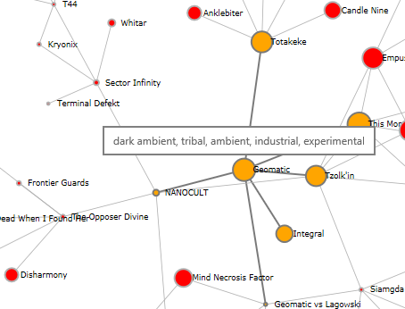

# What is this thing?

It's a web app that allows you to discover new music based on artists you like. Just enter you favorite artist's name and the app will draw you a graph of his relations (artists that perform in a similar style). Click a related artist to find out what his relations are. Hover the mouse over an artist to see what style he is performing in. Searching for relations may take several seconds, and there are no progress indicator yet, so be patient.

Other things you can do:
- Use mouse scroll to zoom in or out.
- Hover the mouse over an artist to highlight his relations. (Becomes useful after some exploration)
- Click and hold the mouse over some artist. While doing so, the graph will move and try to take a more aesthetic look.
- You can also help the graph taking the layout you want by dragging artists around.

#Used Technologies

- **ASP Core 1.1** backend. 
- Frontend is in **TypeScript** 2.1. During build it is transpiled into es2015 and wrapped with AMD. No  minification yet. 
- Frontend build is automated with **Gulp**. 
- JS Packages are obtained via npm, with typings from npm `@types/`
- Used **D3** library to compose Svg DOM for artists graph and calculate it's forces.
- Artists data is queried from **Last.fm API** at the backend.
- API for frontend is powered by **SignalR**.
- UI (the search bar) is using MVVM pattern provided by **Knockout.js**
- **xUnit** unit tests for backend.
- For frontend unit testing I plan to use Mocha and Karma for integration/D3 DOM tests.

#How to build

I used Visual Studio Community 2015. Just hit Publish, or type `dotnet publish --output ../../artifacts/Vme` in the command line from the project folder. Output will appear in `artifacts/` folder at the repo's root. 

In order to run the app, a valid last.fm api key must be specified in `setting.json`. You can configure web server listening address and port in `hosting.json`.

